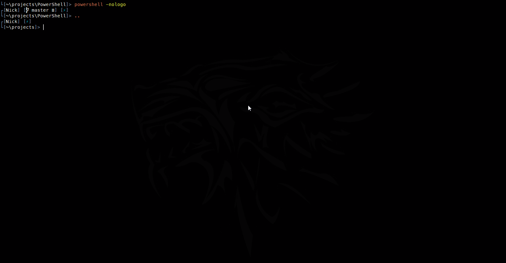

[](https://coveralls.io/github/nickcox/cd-extras?branch=master)

# cd-extras

<!-- TOC -->

- [Navigation helpers](#navigation-helpers)
- [AUTO_CD](#auto_cd)
- [CD_PATH](#cd_path)
- [CDABLE_VARS](#cdable_vars)
- [No argument cd](#no-argument-cd)
- [Two argument cd](#two-argument-cd)
- [Expansion](#expansion)
  - [Enhanced expansion for built-ins](#enhanced-expansion-for-built-ins)
  - [Path shortening](#path-shortening)
  - [Navigation helper expansions](#navigation-helper-expansions)
  - [Multi-dot and variable based expansions](#multi-dot-and-variable-based-expansions)
- [Additional helpers](#additional-helpers)
- [Note on compatibility](#note-on-compatibility)
  - [Alternative providers](#alternative-providers)
  - [OS X & Linux](#os-x--linux)
- [Install](#install)
- [Configure](#configure)

<!-- /TOC -->

# What is it?

general conveniences for the `cd` command in PowerShell stolen from bash and zsh



## Navigation helpers

Provides the following aliases (and corresponding functions):

- `up`, `..` (`Step-Up`)
- `cd-` (`Undo-Location`)
- `cd+` (`Redo-Location`)
- `cd:` (`Switch-LocationPart`)
- `cdb` (`Step-Back`)

Examples:

```sh
[C:\Windows\System32]> up # or ..
[C:\Windows]> cd-
[C:\Windows\System32]> cd+
[C:\Windows]> _
```

Note that the aliases are `cd-` and `cd+` _not_ `cd -` and `cd +`.
Repeated uses of `cd-` will keep moving backwards towards the beginning of the stack
rather than toggling between the two most recent directories as in vanilla bash. (Use
`Step-Back` (`cdb`) to toggle between the current and previous directories.)

```sh
[C:\Windows\System32]> ..
[C:\Windows]> ..
[C:\]> cd-
[C:\Windows]> cd-
[C:\Windows\System32]> cd+
[C:\Windows]> cd+
[C:\]> cdb
[C:\Windows]> cdb
[C:\]> _
```

`up`, `cd+` and `cd-` each take a single optional parameter: either a number, `n`,
used to specify the number of levels or locations to traverse, as in:

```sh
[C:\Windows\System32]> .. 2 # or `up 2`
[C:\]> cd temp
[C:\temp]> cd- 2
[C:\Windows\System32]> cd+ 2
[C:\temp]> _
```

...or a string, `NamePart`, used to change to the nearest directory whose name matches
the given argument. [Tab completion](#navigation-helper-expansions) is provided
for all of these helpers.

```sh
[C:\Windows\System32\drivers\etc]> up win # or `.. win`
[C:\Windows]> _
```

The logic of `cd- <NamePart>` and `cd+ <NamePart>` is to search the stack, starting at
the current location, for directories whose name contains the given string. If none is found
then it will attempt to match against the full path instead. For example:

```sh
[C:\Windows]> cd system32
[C:\Windows\System32]> cd drivers
[C:\Windows\System32\drivers]> cd- sys
[C:\Windows\System32]> cd+
[C:\Windows\System32\drivers]> cd- win
[C:\Windows\]> cd+ 32/dr
[C:\Windows\System32\drivers]> _
```

When the [AUTO_CD](#auto_cd) option is enabled, multiple dot syntax for `up` is supported
as an alternative to `up [n]`. [Tab completions](#multi-dot-and-variable-based-expansions)
are available.

```sh
[C:\Windows\System32\drivers\etc]> ... # same as `up 2` or `.. 2`
[C:\Windows\System32]> cd-
[C:\Windows\System32\drivers\etc>] .... # same as `up 3` or `.. 3`
[C:\Windows]> _
```

## AUTO_CD

Change directory without typing `cd`.

```sh
[~]> projects
[~/projects]> cd-extras
[~/projects/cd-extras]> _
```

As with the `cd` command, [abbreviated paths](#path-shortening) are supported.

```sh
[~]> pr
[~/projects]> cd-e
[~/projects/cd-extras]> _
```

## CD_PATH

Search additional locations for candidate directories. [Tab-expansion](#enhanced-expansion-for-built-ins) into `CD_PATH` directories is provided.

```sh
[~]> $cde.CD_PATH = @('~/documents')
[~]> cd WindowsPowerShell
[~/documents/WindowsPowerShell]> _
```

Note that `CD_PATH`s are _not_ searched when an absolute or relative path is given.

```sh
[~]> $cde.CD_PATH = @('~/documents')
[~]> cd ./WindowsPowerShell
Set-Location : Cannot find path '~\WindowsPowerShell' because it does not exist.
```

## CDABLE_VARS

Save yourself a `$` when cding into folders using a variable name and enable [completion](#multi-dot-and-variable-based-expansions)
for child directories. Given a variable containing the path to a folder (configured, perhaps,
in your `$PROFILE` or by invoking [`Export-Up`](#multi-dot-and-variable-based-expansions)), you can `cd` into it using the name of the variable.

```sh
[~]> $power = '~/projects/powershell'
[~]> cd power
[~/projects/powershell]> _
```

This works with relative paths too, so if you find yourself frequently `cd`ing into the same
subdirectories you could create a corresponding variable.

```sh
[~/projects/powershell]> $gh = './.git/hooks'
[~/projects/powershell]> cd gh
[~/projects/powershell/.git/hooks]> _
```

CDABLE_VARS is off by default. Enable it with: `Set-CdExtrasOption CDABLE_VARS $true`.

## No argument cd

If the option `$cde.NOARG_CD` is defined then `cd` with no arguments
will change to the nominated directory. Defaults to `'~'`.

```sh
[C:\Windows\System32\]> cd
[~]> _
```

## Two argument cd

Replaces all instances of the first argument in the current path with the second argument,
changing to the resulting directory if it exists. Uses the `Switch-LocationPart` (`cd:`) function.

```sh
[~\Modules\Unix\Microsoft.PowerShell.Utility]> cd unix shared
[~\Modules\Shared\Microsoft.PowerShell.Utility]> _
```

## Expansion

### Enhanced expansion for built-ins

`cd`, `pushd` and `ls` (by default) provide enhanced tab completions, expanding all path
segments so that you don't have to individually tab through each one.

```sh
[~]> cd /w/s/set<[Tab]><[Tab]>
C:\Windows\System32\setup\  C:\Windows\SysWOW64\setup\
                            ‾‾‾‾‾‾‾‾‾‾‾‾‾‾‾‾‾‾‾‾‾‾‾‾‾‾
```

Periods (`.`) are expanded around so, for example, a segment containing `.sdk`
is expanded into `*.sdk*`.

```sh
[~]> cd proj/pow/s/.sdk<[Tab]><[Enter]>
[~\projects\powershell\src\Microsoft.PowerShell.SDK]> _
```

You can change the list of commands that participate in enhanced directory completion using
the `DirCompletions` [option](#configure):

```sh
[~]> Set-CdExtrasOption DirCompletions ($cde.DirCompletions + 'mkdir')
[~]> mkdir ~/pow/src<[Tab]>
[~]> mkdir ~\powershell\src\_
```

It's also possible to opt into enhanced file-only or general (file & directory) completion using
the `FileCompletions` and `PathCompletions` options respectively.

```sh
[~]> Set-CdExtrasOption PathCompletions ($cde.DirCompletions + 'Invoke-Item')
[~]> ii /t/<[Tab]>
C:\temp\subdir  C:\temp\txtFile.txt  C:\temp\txtFile2.txt
‾‾‾‾‾‾‾‾‾‾‾‾‾‾
```

Paths within the `$cde.CD_PATH` array are considered for expansion by all completion types.

```sh
[~]> $cde.CD_PATH += "~\Documents\"
[~]> cd win/mod
[~\Documents\WindowsPowerShell\Modules]> _
```

### Path shortening

If an unambiguous match is available then `cd` can be used directly, without first
invoking tab expansion.

```sh
[~]> cd /w/s/d/et
[C:\Windows\System32\drivers\etc]> cd ~/pr/pow/src
[~\projects\PowerShell\src]> cd .sdk
[~\projects\PowerShell\src\Microsoft.PowerShell.SDK]> _
```

### Navigation helper expansions

Expansions are provided for the `cd+`, `cd-` and `up` (or `..`) aliases.

When the `MenuCompletion` option is set to `$true` the completion offered is the
index of each corresponding directory; the full path is displayed in the menu below.
`cd-extras` will attempt to detect `PSReadLine` in order to set this
option appropriately at start-up. For example:

```sh
[C:\Windows\System32\drivers\etc]> up <[Tab]>
[C:\Windows\System32\drivers\etc]> up 1
1. drivers  2. System32  3. Windows
‾‾‾‾‾‾‾‾‾‾‾
[C:\Windows\System32\drivers\etc]> up 3
3. Windows
‾‾‾‾‾‾‾‾‾‾‾
```

It's also possible tab-complete these three commands (`cd+`, `cd-`, `up`) using a
partial directory name.

```sh
[~\projects\PowerShell\src\Modules\Shared]> up pr<[Tab]>
[~\projects\PowerShell\src\Modules\Shared]> up '~\projects'
[~\projects]> _
```

### Multi-dot and variable based expansions

The multi-dot syntax provides tab completion into ancestor directories.

```sh
[C:\projects\powershell\docs\git]> cd ...<[Tab]>
[C:\projects\powershell\docs\git]> cd C:\projects\powershell\
```

```sh
[C:\projects\powershell\docs\git]> cd .../<[Tab]>

C:\projects\powershell\.git     C:\projects\powershell\.vscode
‾‾‾‾‾‾‾‾‾‾‾‾‾‾‾‾‾‾‾‾‾‾‾‾‾‾‾‾‾
C:\projects\powershell\demos    C:\projects\powershell\docs

C:\projects\powershell\test     C:\projects\powershell\.github

C:\projects\powershell\assets   C:\projects\powershell\docker

C:\projects\powershell\src      C:\projects\powershell\tools
```

`Export-Up` (`xup`) recursively expands each parent path into a global variable
with a corresponding name. Why? In combination with [CDABLE_VARS](#cdable_vars),
it can be useful for navigating a deeply nested folder structure without needing
to count `..`s. For example:

```sh
[C:\projects\powershell\src\Modules\Unix]> xup

Name                           Value
----                           -----
Unix                           C:\projects\powershell\src\Modules\Unix
Modules                        C:\projects\powershell\src\Modules
src                            C:\projects\powershell\src
powershell                     C:\projects\powershell
projects                       C:\projects

[C:\projects\powershell\src\Modules\Unix]> cd po<[Tab]>
[C:\projects\powershell\src\Modules\Unix]> cd C:\projects\powershell\_
```

might be easier than:

```sh
[C:\projects\powershell\src\Modules\Unix]> cd ....<[Tab]> # or cd ../../../<[Tab]>
[C:\projects\powershell\src\Modules\Unix]> cd C:\projects\powershell\_
```

You can combine this with [AUTO_CD](#auto_cd) for great good:

```sh
[C:\projects\powershell\src\Modules\Unix]> projects
[C:\projects]> src
[C:\projects\powershell\src]> _
```

## Additional helpers

- Get-Stack
  - view contents of undo (`cd-`) and redo (`cd+`) stacks;
    limit output with the `-Undo` or `-Redo` switches
- Get-Up
  - get the path of an ancestor directory, either by name or by traversing upwards n levels
- Expand-Path
  - helper used for path segment expansion
- Set-CdExtrasOption
  - [configure](#configure) cd-extras

## Note on compatibility

### Alternative providers

The functionality discussed above is intended to work against the filesystem provider. Most things
should work with other providers too though.

```sh
[~]> cd hklm:
[HKLM:]> cd so/mic/win/cur/windowsupdate
[HKLM:\SOFTWARE\Microsoft\Windows\CurrentVersion\WindowsUpdate]> ..
[HKLM:\SOFTWARE\Microsoft\Windows\CurrentVersion]> cd-
[HKLM:\SOFTWARE\Microsoft\Windows\CurrentVersion\WindowsUpdate]> cd- 2
[~]> _
```

### OS X & Linux

Functionality is tested and _should_ work on non-Windows operating systems. It's entirely
likely you'll encounter some rough edges, though. In particular the best `$cde.MenuCompletion`
setting may not be detected automatically; you might need to change it yourself.
You'll also notice that cd-extras is quite permissive with respect to the casing of paths
so path shortening won't work in cases where multiple possible path abbreviations differ
only by case.

# Get started

## Install

```sh
Install-Module cd-extras
Import-Module cd-extras

# add to profile. e.g:
Add-Content $PROFILE @("`n", "Import-Module cd-extras")
```

## Configure

Options provided:

- _AUTO_CD_: `[bool] = $true`
  - Any truthy value enables auto_cd.
- _CD_PATH_: `[array] = @()`
  - Paths to be searched by `cd` and tab expansion. Note: this is an array, not a delimited string.
- _CDABLE_VARS_: `[bool] = $false`
  - `cd` and tab-expand into directory paths stored in variables without prefixing the variable
    name with `$`.
- _NOARG_CD_: `[string] = '~'`
  - If specified, `cd` command with no arguments will change to this directory.
- _MenuCompletion_: `[bool] = $true` (if PSReadLine available)
  - If truthy, indexes are offered as completions for `up`, `cd+` and `cd-` with full paths
    displayed in the menu
- _DirCompletions_: `[array] = @('Push-Location', 'Set-Location', 'Get-ChildItem')`
  - Commands that participate in enhanced tab expansion for directories.
- _FileCompletions_: `[array] = @()`
  - Commands that participate in enhanced tab expansion for files.
- _PathCompletions_: `[array] = @()`
  - Commands that participate in enhanced tab expansion for any type of path.

Either create a global hashtable, `cde`, with one or more of these keys _before_ importing
the cd-extras module:

```sh
$global:cde = @{
  AUTO_CD = $false
  CD_PATH = @('~\Documents\', '~\Downloads')
}

Import-Module cd-extras
```

or call the `Set-CdExtrasOption` function after importing the module:

```sh
Import-Module cd-extras

Set-CdExtrasOption AUTO_CD $false
Set-CdExtrasOption NOARG_CD '/'
```
