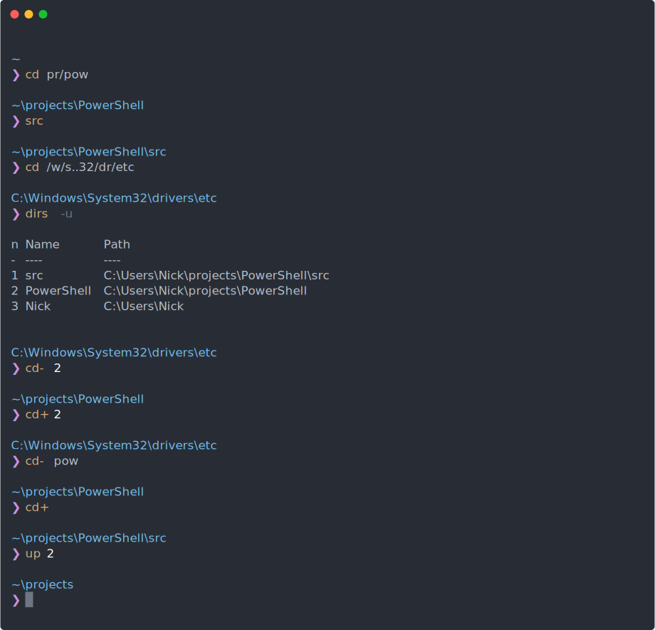

[
](https://codecov.io/gh/nickcox/cd-extras)
[
](https://www.powershellgallery.com/packages/cd-extras)



cd-extras
===========

<!-- TOC -->

- [cd-extras](#cd-extras)
- [Navigation helper commands](#navigation-helper-commands)
  - [Parameters](#parameters)
  - [Output](#output)
  - [Completions](#completions)
  - [Listing available navigation targets](#listing-available-navigation-targets)
- [cd enhancements](#cd-enhancements)
  - [Path shortening](#path-shortening)
  - [Multi-dot cd](#multi-dot-cd)
  - [No argument cd](#no-argument-cd)
  - [Two argument cd](#two-argument-cd)
- [Enhanced completion for cd and others](#enhanced-completion-for-cd-and-others)
  - [Single and double periods](#single-and-double-periods)
  - [Multi-dot completions](#multi-dot-completions)
  - [Variable based completions](#variable-based-completions)
  - [Extending completion to other commands](#extending-completion-to-other-commands)
  - [Colourised completions](#colourised-completions)
- [AUTO CD](#auto-cd)
  - [Tilde](#tilde)
  - [Multi-dot](#multi-dot)
- [CD PATH](#cd-path)
- [CDABLE VARS](#cdable-vars)
- [Additional helpers](#additional-helpers)
  - [Get-Up gup](#get-up-gup)
  - [Get-Stack dirs](#get-stack-dirs)
  - [Clear-Stack dirsc](#clear-stack-dirsc)
  - [Expand-Path xpa](#expand-path-xpa)
- [Compatibility](#compatibility)
  - [Alternative providers](#alternative-providers)
  - [OS X & Linux](#os-x--linux)
- [Install](#install)
- [Configure](#configure)
  - [cd-extras options](#cd-extras-options)
  - [Navigation helper key handlers](#navigation-helper-key-handlers)
  - [Using a different alias](#using-a-different-alias)

<!-- /TOC -->


# Navigation helper commands

**Quickly navigate backwards, forwards, upwards or between two directories**

<details>
<summary>[<i>Watch</i>]<p/></summary>


</details>

_cd-extras_ provides the following navigation helpers and corresponding aliases (shown in parens):

- `Undo-Location`, (`cd-` or `~`)
- `Redo-Location`, (`cd+` or `~~`)
- `Step-Up`, (`up`or `..`)
- `Step-Between`, (`cdb`)

```powershell
[C:/Windows/System32]> up # or ..
[C:/Windows]> cd- # or ~
[C:/Windows/System32]> cd+ # or ~~
[C:/Windows]> █
```

:point_right:
That's `cd-` and `cd+`, without a space. `cd -` and `cd +` (with a space) also work but you won't
get [auto-completions](#completions).

Repeated uses of `cd-`  keep moving backwards towards the beginning of the stack rather than
toggling between the two most recent directories as in vanilla bash. Use `Step-Between` (`cdb`)
if you want to toggle between directories.

```powershell
[C:/Windows/System32]> cd ..
[C:/Windows]> cd ..
[C:/]> cd-
[C:/Windows]> cd-
[C:/Windows/System32]> cd+
[C:/Windows]> cd+
[C:/]> cdb
[C:/Windows]> cdb
[C:/]> █
```


## Parameters

`up`, `cd+` and `cd-` each take a single optional argument: either a number of steps, `n`...

```powershell
[C:/Windows/System32]> .. 2 # or `up 2`
[C:/]> cd temp
[C:/temp]> cd- 2 # `cd -2`, `~ 2` or just `~2` also work
[C:/Windows/System32]> cd+ 2
[C:/temp]> █
```

...or a string, `NamePart`, used to select the nearest matching directory from the available
locations. Given a `NamePart`, _cd-extras_ will search from the current location for directories
whose leaf name contains the given string⁽¹⁾. If none is found then it will attempt to find a match
within the full path of each candidate directory⁽²⁾.

```powershell
[C:/Windows]> cd system32
[C:/Windows/System32]> cd drivers
[C:/Windows/System32/drivers]> cd- win # [ex. 1] by leaf name
[C:/Windows/]> cd+ 32/dr # [ex. 2] by full name
[C:/Windows/System32/drivers]> up win # by leaf name again
[C:/Windows]> █
```


## Output

Each helper includes a `-PassThru` switch to return a `PathInfo` value in case you need a
reference to the resulting directory. The value will be `$null` if the action wasn't completed.
(For example, if there was nothing in the stack or you attempted to navigate up from the root.)

```powershell
[C:/Windows/System32]> up -PassThru

Path
----
C:\Windows

[C:/Windows]> cd- -PassThru

Path
----
C:\Windows\System32

[C:/Windows/System32]> █
```


## Completions

Auto-completions are provided for each of `cd-`, `cd+`, and `up`.

Assuming the [_PSReadLine_][0] `MenuComplete` function is bound to tab...

```powershell
[C:]> Get-PSReadLineKeyHandler -Bound | Where Function -eq MenuComplete
```
```
Completion functions
====================

Key           Function     Description
---           --------     -----------
Tab           MenuComplete Complete the input if there is a single completion ...
...
```

...then tabbing (`⇥`) through any of the navigation helpers will display a menu based completion.

```powershell
[C:/Windows/System32/drivers/etc]> up ⇥⇥
[C:/Windows/System32/drivers/etc]> up 2

1. drivers  2. System32  3. Windows  4. C:\
            ────────────

C:\Windows\System32
```

The _`IndexedCompletion`_ option controls how completion text is displayed. When _IndexedCompletion_
is on and more than one completion is available, the completions offered are the *indices* of each
corresponding directory; the directory name is displayed in the menu below. The full directory path
is given in the tooltip if you have _PSReadLine_ tooltips enabled.

_cd-extras_ detects _PSReadLine_ options in order to set _IndexedCompletion_ at startup. If the
_PSReadLine_ `MenuComplete` option is bound to at least one key combination then _IndexedCompletion_
is turned on by default. You can turn it off if you prefer.

```powershell
[C:/Windows/System32/drivers/etc]> setocd IndexedCompletion 0
[C:/Windows/System32/drivers/etc]> up ⇥⇥
[C:/Windows/System32/drivers/etc]> up C:\Windows\System32 <--- full path shown

1. drivers  2. System32  3. Windows  4. C:\
            ────────────

C:\Windows\System32
```


It's also possible to tab-complete `cd-`, `cd+` and `up` using a partial directory name (i.e. the
[`NamePart` parameter](#parameters)).

```powershell
[~/projects/PowerShell/src/Modules/Shared]> up pr⇥
[~/projects/PowerShell/src/Modules/Shared]> up '~\projects'
[~/projects]> █
```


## Listing available navigation targets

As an alternative to menu completion you retrieve a list of available targets with:

- `Get-Stack -Undo` (`dirs -u`)
- `Get-Stack -Redo` (`dirs -r`)
- `Get-Ancestors` (`xup`)

```powershell
[C:/Windows/System32/drivers]> Get-Ancestors # xup

n Name        Path
- ----        ----
1 System32    C:\Windows\System32
2 Windows     C:\Windows
3 C:\         C:\

[C:/Windows/System32/drivers]> up 2
[C:/Windows]> up 1
[C:/]> dirs -u # dirs -v also works

n Name        Path
- ----        ----
1 Windows     C:\Windows
2 drivers     C:\Windows\System32\drivers

[C:/]> cd- 2
[C:/Windows/System32/drivers]> █
```


# `cd` enhancements

**Shortcuts and tab completions for the `cd` command**

<details>
<summary>[<i>Watch</i>]<p/></summary>


</details>

`cd-extras` provides a proxy to `Set-Location` - called `Set-LocationEx` - and aliases it to `cd`
by default, giving it several new abilities:

* [Path shortening](#Path-shortening)
* [Multi-dot `cd`](#Multi-dot-cd)
* [No argument `cd`](#No-argument-cd)
* [Two argument `cd`](#Two-argument-cd)
* [Enhanced tab completions](#Enhanced-completion-for-cd-and-others)


## Path shortening

If an unambiguous match is available then `cd` can change directory using an abbreviated path.
This effectively changes a path given as, `p` into `p*` or `~/pr/pow/src` into `~/pr*/pow*/src*`.
If you're not sure whether an unambiguous match is available then just hit tab to pick from a
[list of potential matches](#enhanced-completion-for-cd-and-others) instead.

```powershell
[~]> cd pr
[~/projects]> cd cd-e
[~/projects/cd-extras]> cd ~
[~]> cd pr/cd
[~/projects/cd-extras]> █
```

Word delimiters (`.`, `_`, `-` by [default](#configure)) are expanded around so a segment
containing `.sdk` is expanded into `*.sdk*`.

```powershell
[~]> cd proj/pow/s/.sdk
[~/projects/powershell/src/Microsoft.PowerShell.SDK]> █
```

:point_right:
Powershell interprets a hyphen at the start of an argument as a parameter name. So while you can do
this...

```powershell
[~/projects/powershell]> cd src/-unix
[~/projects/PowerShell/src/powershell-unix]> █
```

... you need to escape this:

```powershell
[~/projects/powershell/src]> cd -unix
Set-LocationEx: A parameter cannot be found that matches parameter name 'unix'.

[~/projects/powershell/src]> cd `-unix # backtick escapes the hypen
[~/projects/PowerShell/src/powershell-unix]> █
```

Pairs of periods are expanded between so, for example, a segment containing `s..32` is expanded
into `s*32`.

```powershell
[~]> cd /w/s..32/d/et
[C:/Windows/System32/drivers/etc]> █
```

Directories in [`CD_PATH`](#cd-path) will be also be shortened.

```powershell
[C:/]> setocd CD_PATH ~/projects
[C:/]> cd p..shell
[~/projects/PowerShell/]> █
```

[`AUTO_CD`](#auto-cd) uses the same expansion algorithm when enabled.

```powershell
[~]> $cde.AUTO_CD
True

[~]> /w/s/d/et
[C:/Windows/System32/drivers/etc]> ~/pr/pow/src
[~/projects/PowerShell/src]> .sdk
[~/projects/PowerShell/src/Microsoft.PowerShell.SDK]> █
```


## Multi-dot `cd`

In the same way that you can navigate up one level with `cd ..`, `Set-LocationEx` supports
navigating multiple levels by adding additional dots. [`AUTO_CD`](#multi-dot) works the same way
if enabled.

```powershell
[C:/Windows/System32/drivers/etc]> cd ... # same as `up 2` or `.. 2`
[C:/Windows/System32]> cd-
[C:/Windows/System32/drivers/etc>] cd .... # same as `up 3` or `.. 3`
[C:/Windows]> █
```


## No argument `cd`

If the _`NOARG_CD`_ [option](#configure) is defined then `cd` without arguments navigates into that
directory (`~` by default). This overrides the out of the box behaviour on PowerShell>=6.0, where
no-arg `cd` _always_ navigates to `~` and PowerShell < 6.0, where no-argument `cd` does nothing at
all.

```powershell
[~/projects/powershell]> cd
[~]> setocd NOARG_CD /
[~]> cd
[C:/]>
```


## Two argument `cd`

Replaces all instances of the first argument in the current path with the second argument,
changing to the resulting directory if it exists, using the `Switch-LocationPart` function.

You can also use the alias `cd:` or the explicit `ReplaceWith` parameter of `Set-LocationEx`.

```powershell
[~/Modules/Unix/Microsoft.PowerShell.Utility]> cd unix shared
[~/Modules/Shared/Microsoft.PowerShell.Utility]> cd: -Replace shared -With unix
[~/Modules/Unix/Microsoft.PowerShell.Utility]> cd unix -ReplaceWith shared
[~/Modules/Shared/Microsoft.PowerShell.Utility]> █
```


# Enhanced completion for `cd` and others

`cd-extras` provides enhanced completion for `cd`, `pushd`, `ls`, `Get-Item` and `Invoke-Item`
by default, expanding all path segments in one go so that you don't have to individually tab (⇥)
through each one. The path shortening logic is provided by `Expand-Path` and works as
[described above](#path-shortening).

```powershell
[~]> cd /w/s/dr⇥⇥
[~]> cd C:\Windows\System32\DriverState\

drivers   DriverState   DriverStore
          ───────────

C:\Windows\System32\DriverState
```

Paths within [`$cde.CD_PATH`](#cd-path) are included in the completion results.

```powershell
[~]> $cde.CD_PATH += '~\Documents\'
[~]> cd win/mod⇥
[~]> ~\Documents\WindowsPowerShell\Modules\█
```

:point_right:
The total number of completions offered is limited by the `MaxCompletions` [option](#configure)
(or calculated dynamically to fit the screen if `MaxCompletions` is falsy). Although the completions
are sorted by type (folders first) and then by name for ease of reading, that sort is applied _after_
the limit has been applied to the original results. Those results are sorted breadth first for
responsiveness.

_A console beep is emitted in cases where the available results have been truncated._


## Single and double periods

Word delimiters (`.`, `_`, `-` [by default](#configure)) are expanded around so, for example, a
segment containing `.sdk` is expanded into `*.sdk*`.

```powershell
[~]> cd proj/pow/s/.sdk⇥
[~]> cd ~\projects\powershell\src\Microsoft.PowerShell.SDK\█
```

or

```powershell
[~]> ls pr/pow/t/ins.sh⇥
[~]> ls ~\projects\powershell\tools\install-powershell.sh
[~]> ls ~\projects\powershell\tools\install-powershell.sh | cat
#!/bin/bash
...

[~]>
```

A double-dot (`..`) token is expanded inside, so `s..32` becomes `s*32`.

```powershell
[~]> ls /w/s..32⇥
[~]> ls C:\Windows\System32\█
```


## Multi-dot completions

The [multi-dot syntax](#multi-dot-cd) provides tab completion into ancestor directories.

```powershell
[~/projects/powershell/docs/git]> cd ...⇥
[~/projects/powershell/docs/git]> cd ~\projects\powershell\█
```

```powershell
[C:/projects/powershell/docs/git]> cd .../⇥

.git     .vscode    demos    docs   test
─────
.github    assets   docker   src    tools

~\projects\powershell\.git
```


## Variable based completions

When [CDABLE_VARS](#cdable-vars) is enabled, completions are available for the names of variables
that contain file paths. This can be combined with the `-Export` option of `Get-Ancestors` (`xup`),
which recursively exports each parent directory's path into a global variable with a corresponding
name.

```powershell
[C:/projects/powershell/src/Modules/Unix]> xup -Export -ExcludeRoot

n Name        Path
- ----        ----
1 Modules     C:\projects\powershell\src\Modules
2 src         C:\projects\powershell\src
3 powershell  C:\projects\powershell
4 projects    C:\projects

[C:/projects/powershell/src/Modules/Unix]> up pow
[C:/projects/powershell]> cd mod⇥
[C:/projects/powershell]> cd .\src\modules\
```


## Extending completion to other commands

You can extend the list of commands that participate in enhanced completion for either
*directories* or *files*, or for both *files and directories*, using the `DirCompletions`
`FileCompletions` and `PathCompletions` [options](#configure) respectively.

(`FileCompletions` is the least useful of the three since you can't tab through intermediate
directories to get to the file you're looking for.)

```powershell
[~]> setocd DirCompletions mkdir
[~]> mkdir ~/pow/src⇥
[~]> mkdir ~\powershell\src\█
[~]> setocd PathCompletions Copy-Item
[~]> cp /t/⇥
[~]> cp C:\temp\subdir\█
subdir  txtFile.txt  txtFile2.txt
──────

C:\temp\subdir
```

In each case, completions work against the target's `Path` parameter; if you want enhanced
completion for a native executable or for a cmdlet without a `Path` parameter then you'll
need to provide a wrapper. Either the wrapper or the target itself should handle expanding
`~` where necessary.

```powershell
[~]> function Invoke-VSCode($path) { &code (rvpa $path) }
[~]> setocd PathCompletions Invoke-VSCode
[~]> Set-Alias co Invoke-VSCode
[~]> co ~/pr/po⇥
[~]> co ~\projects\powershell\█
```

An alternative to registering a bunch of aliases is to create a tiny wrapper to pipe input
from `ls`, `gi` or `xpa`.

```powershell
[~]> function to($target) { &$target $input }
[~]> xpa ~/pr/po/r.md⇥
[~]> xpa ~/projects/powershell/readme.md | to bat

───────────────────────────────────────────────────────
File: C:\Users\Nick\projects\PowerShell\README.md
───────────────────────────────────────────────────────
1 | ...
2 | ...
```

:point_right:
You can skip tab completion altogether and use [Expand-Path](#expand-path-xpa) directly if you
know exactly what you're looking for.

```powershell
[~]> xpa ~/pr/po/r.md | to bat

───────────────────────────────────────────────────────
File: C:\Users\Nick\projects\PowerShell\README.md
───────────────────────────────────────────────────────
1 | ...
2 | ...
```


## Colourised completions

The _`ColorCompletion`_ [option](#configure) enables colourisation of completions in the filesystem
provider via [_DirColors_][1] or via your own global `Format-ColorizedFilename` function of type
`[System.IO.FileSystemInfo] -> [String]`.

:point_right:
_ColorCompletion_ is off by default. Enable it on with `setocd ColorCompletion`.


# AUTO CD

**Change directory without typing `cd`**

<details>
<summary>[<i>Watch</i>]<p/></summary>


</details>

```powershell
[~]> projects
[~/projects]> cd-extras
[~/projects/cd-extras]> /
[C:/]> █
```

As with the [enhanced `cd`](#cd-enhancements) command, [abbreviated paths](#path-shortening)
and [multi-dot syntax](#multi-dot-cd) are supported.

```powershell
[~]> pr
[~/projects]> cd-e
[~/projects/cd-extras]> cd
[~]> pr/cd
[~/projects/cd-extras]> █
```


## Tilde

`AUTO_CD` supports a shorthand syntax for `cd-` using tilde (`~`). You can use this with or
without a space between tilde and the number, although [tab completion](#completions) only works
after a space (`~ ⇥`).

```powershell
[C:/Windows/System32]> /
[C:/]> temp
[C:/temp]> dirs -u

n Name      Path
- ----      ----
0 temp      C:\temp
1 C:\       C:\
2 System32  C:\Windows\System32

[C:/temp]> ~2 # or ~ 2
[C:/Windows/System32]> ~~2 # or ~~ 2
[C:/temp]> █
```


## Multi-dot

[Multi-dot syntax](#multi-dot-cd) works with `AUTO_CD` as an alternative to `up [n]`.

```powershell
[C:/Windows/System32/drivers/etc]> ... # same as `up 2` or `.. 2`
[C:/Windows/System32]> cd-
[C:/Windows/System32/drivers/etc>] .... # same as `up 3` or `.. 3`
[C:/Windows]>  █
```


# CD PATH

**Additional base directories for the `cd` command**

```powershell
[~]> setocd CD_PATH ~/documents
[~]> # or $cde.CD_PATH = ,'~/documents'
[~]> cd WindowsPowerShell
[~/documents/WindowsPowerShell]> █
```

[Tab-completion](#enhanced-completion-for-cd-and-others), [path shortening](#path-shortening) and
[Expand-Path](#expand-path-xpa) work with `CD_PATH` directories.

`CD_PATH`s are _not_ searched when an absolute or relative path is given.

```powershell
[~]> setocd CD_PATH ~/documents
[~]> cd ./WindowsPowerShell
Set-Location : Cannot find path '~\WindowsPowerShell'...
```

:point_right:
Unlike bash, the current directory is always included when a relative path is used. If a child
with the same name exists in both the current directory and a `CD_PATH` directory then `cd` will
prefer the former.

```powershell
[~]> mkdir -f child, someDir/child
[~]> resolve-path someDir | setocd CD_PATH
[~]> cd child
[~/child]> cd child
[~/someDir/child]> █
```

:point_right:
The value of `CD_PATH` is an array, not a delimited string as it is in bash.
```powershell
[~]> setocd CD_PATH ~/Documents/, ~/Downloads
[~]> $cde.CD_PATH
~/Documents
~/Downloads
```


# CDABLE VARS

**`cd` into variables without the `$` and enable tab completion into child directories**

Given a variable containing a folder path (configured in your `$PROFILE`, perhaps, or by invoking
[`Get-Ancestors -Export`](#variable-based-completions)), you can `cd` into it using the variable
name.

:point_right:
CDABLE_VARS is off by default; enable it with, [`setocd CDABLE_VARS`](#configure).

```powershell
[~/projects/powershell]> setocd CDABLE_VARS
[~/projects/powershell]> $bk1 = $pwd
[~/projects/powershell]> cd
[~]> cd bk1
[~/projects/powershell]> █
```

It works with relative paths too, so if you find yourself frequently `cd`ing into the same
subdirectories you could create a corresponding variable.

```powershell
[~/projects/powershell]> $gh = './.git/hooks'
[~/projects/powershell]> cd gh
[~/projects/powershell/.git/hooks]> █
```

You can combine it with [AUTO_CD](#auto-cd) for great good:

```powershell
[C:/projects/powershell/src/Modules/Unix]> xup -Export | out-null
[C:/projects/powershell/src/Modules/Unix]> projects
[C:/projects]> src
[C:/projects/powershell/src]> █
```


# Additional helpers

## Get-Up (gup)

Gets the path of an ancestor directory, either by name or by number of levels (`n`), returning the
parent of the current directory by default. It supports consuming values from the pipeline so you
can do things like:

```powershell
[C:/projects]> # find git repositories
[C:/projects]> ls .git -Force -Depth 2 | gup
C:\projects\cd-extras
C:\projects\work\app
...

[C:/projects]> # find chocolatey root directory
[C:/projects]> gcm choco | gup 2
C:\ProgramData\chocolatey
```


## Get-Stack (dirs)

View contents of undo (`cd-`) and redo (`cd+`) stacks.

Use `dirs -u` for an indexed list of undo locations, `dirs -r` for a corresponding list of redo
locations, or just `dirs` to see both.


## Clear-Stack (dirsc)

Clear contents of undo (`cd-`) and/or redo (`cd+`) stacks.

## Expand-Path (xpa)
Expands a candidate path by inserting wildcards between each segment. Use a trailing slash to
expand *children* of the matched path(s). Contents of `CD_PATH` will be included.

:point_right:
The expansion may match more than you expect. Test the output before piping it into a potentially
destructive command.


# Compatibility

## OS X & Linux

`cd-extras` works on non-Windows operating systems. The `IndexedCompletion` option is off by
default unless you configured PSReadLine with a `MenuComplete` keybinding _before_ importing
`cd-extras`.

```powershell
Set-PSReadLineKeyHandler -Key Tab -Function MenuComplete
```

Otherwise you can enable `cd-extras` menu completions manually with:

```powershell
setocd IndexedCompletion
```

## Alternative providers

_cd-extras_ is primarily intended to work against the filesystem provider but it should work with
other providers too.

```powershell
[~]> cd hklm:\
[HKLM:]> cd so/mic/win/cur/windowsupdate
[HKLM:/SOFTWARE/Microsoft/Windows/CurrentVersion/WindowsUpdate]> ..
[HKLM:/SOFTWARE/Microsoft/Windows/CurrentVersion]> cd-
[HKLM:/SOFTWARE/Microsoft/Windows/CurrentVersion/WindowsUpdate]> cd- 2
[~]> █
```

# Install

From the [gallery](https://www.powershellgallery.com/packages/cd-extras/)

```powershell
Install-Module cd-extras
Import-Module cd-extras

# add to profile. e.g:

Add-Content $PROFILE `n, 'Import-Module cd-extras'
```

or get the latest from github

```powershell
git clone git@github.com:nickcox/cd-extras.git
Import-Module cd-extras/cd-extras/cd-extras.psd1 # yep, three :D
```


# Configure

## cd-extras options

- _AUTO_CD_: `[bool] = $true`
  - Enables auto_cd.
- _CDABLE_VARS_: `[bool] = $false`
  - Enables cdable_vars.
- _NOARG_CD_: `[string] = '~'`
  - If specified, `cd` with no arguments will change into the given directory.
- _CD_PATH_: `[string[]] = @()`
  - Paths to be searched by `cd` and tab completion. An array, not a delimited string.
- _WordDelimiters_ : `[string[]] = '.', '_', '-'`
  - Word boundaries within path segments. For example, `.foo` will be expanded into `*.foo*`.
- _ToolTipExtraInfo_ : `[ScriptBlock] = $null`
  - Optional extra information displayed after the file path in the menu-completion tooltip.
  This should take a single argument, the current item, and return a string.
- _IndexedCompletion_: `[bool] = $true (if MenuComplete key bound)`
  - If truthy, indexes are offered as completions for `up`, `cd+` and `cd-` with full paths
    displayed in the menu.
- _DirCompletions_: `[string[]] = 'Set-Location', 'Set-LocationEx', 'Push-Location'`
  - Commands that participate in enhanced tab completion for directories.
- _PathCompletions_: `[string[]] = 'Get-ChildItem', 'Get-Item', 'Invoke-Item', 'Expand-Path'`
  - Commands that participate in enhanced tab completion for any path (files or directories).
- _FileCompletions_: `[string[]] = @()`
  - Commands that participate in enhanced tab completion for files.
- _ColorCompletion_ : `[bool] = false`
  - When truthy, dir/path/file completions will be coloured by `Format-ColorizedFilename`, if
    available.
- _MaxMenuLength_ : `[int] = 35`
  - Truncate completion menu items to this length.
- _MaxCompletions_ : `[int] = 0`
  - Limit the number of menu completions offered. If falsy then _cd_extras_ will attempt to
  calculate the maximum number of completions that can fit on the screen given the current
  `$Host.UI.RawUI.WindowSize` and `$cde.MaxMenuLength`. Otherwise should be no greater than
  `(Get-PSReadLineOption).CompletionQueryItems`.

To configure _cd-extras_ create a hashtable, `cde`, with one or more of these keys _before_
importing it:

```powershell
$cde = @{
  AUTO_CD = $false
  CD_PATH = '~/Documents/', '~/Downloads'
}

Import-Module cd-extras
```

or call the `Set-CdExtrasOption` (`setocd`) function after importing the module:

```powershell
Import-Module cd-extras

setocd PathCompletions Invoke-VSCode # appends PathCompletions
setocd CDABLE_VARS # turns CDABLE_VARS on
setocd AUTO_CD 0 # turns AUTO_CD off
setocd MaxCompletions 0 # auto calculate the maximum number of completions to display

# append the mode string for each item to the completion tooltip
setocd ToolTipExtraInfo {if ($mode = $args[0].Mode) { " ($mode)" }}
```

:point_right:
If you want to opt out of the default [completions](#enhanced-completion-for-cd-and-others)
then you should do it before _cd-extras_ is loaded since PowerShell doesn't provide a way to
unregister argument completers.

```powershell
$cde = @{ DirCompletions = @() }
Import-Module cd-extras
```


## Navigation helper key handlers

If you want to bind [navigation helpers](#navigation-helpers) to _PSReadLine_ [key handlers][2]
then you'll probably want to redraw the prompt after navigation.

```powershell
function invokePrompt() { [Microsoft.PowerShell.PSConsoleReadLine]::InvokePrompt() }
@{
  'Alt+^'         = { if (up  -PassThru) { invokePrompt } }
  'Alt+['         = { if (cd- -PassThru) { invokePrompt } }
  'Alt+]'         = { if (cd+ -PassThru) { invokePrompt } }
  'Alt+Backspace' = { if (cdb -PassThru) { invokePrompt } }
}.GetEnumerator() | % { Set-PSReadLineKeyHandler $_.Name $_.Value }
```


## Using a different alias

_cd-extras_ aliases `cd` to its proxy command, `Set-LocationEx`. If you want a different alias
then you'll probably want to restore the original `cd` alias too.

```powershell
[~]> set-alias cd set-location -Option AllScope
[~]> set-alias cde set-locationex
[~]> cde /w/s/d/et
[C:/Windows/System32/drivers/etc]> cd- # still cd-, not cde-
[~]> █
```

:point_right:
`cd-extras` will only remember locations visited via `Set-LocationEx` or its alias.

```powershell
[~]> dirs -u

[~]> Set-Location code
[~/code]> cd-
[~/code]> █
```

[0]: https://github.com/PowerShell/PSReadLine
[1]: https://github.com/DHowett/DirColors
[2]: https://docs.microsoft.com/powershell/module/psreadline/set-psreadlinekeyhandler
