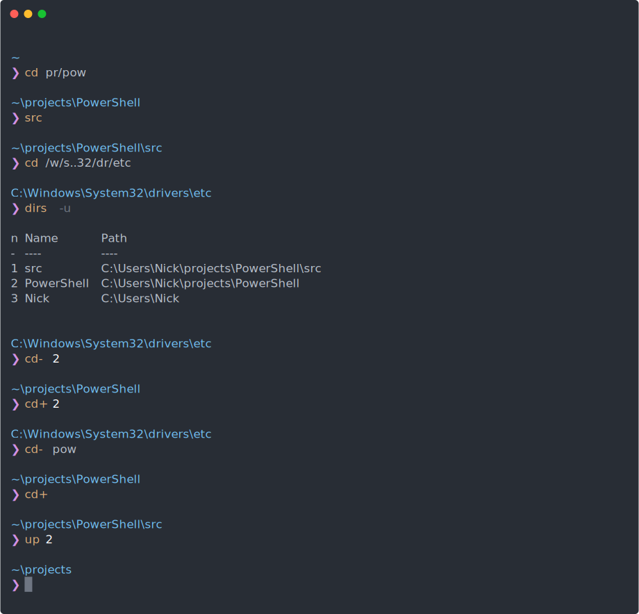

[
](https://codecov.io/gh/nickcox/cd-extras)
[
](https://www.powershellgallery.com/packages/cd-extras)



cd-extras
===========

Smarter directory navigation for PowerShell: stack-based movement, recent and frecent jumps,
abbreviated paths, multi-dot `cd`, and enhanced path completion.


## Install

From the [gallery](https://www.powershellgallery.com/packages/cd-extras/):

```powershell
Install-Module cd-extras
Import-Module cd-extras

# add to profile. e.g:

Add-Content $PROFILE `n, 'Import-Module cd-extras'
```

or get the latest from github:

```powershell
git clone https://github.com/nickcox/cd-extras.git
Import-Module cd-extras/cd-extras/cd-extras.psd1 # yep, three :D
```


## Quick start

Navigate backward, forward, and upward through directory history:

```powershell
[C:/Windows/System32]> up       # or ..
[C:/Windows]> cd-               # or ~
[C:/Windows/System32]> cd+      # or ~~
[C:/Windows]> cdr               # jump to recent directory
```

Use abbreviated paths with `cd`:

```powershell
[~]> cd pr/cd
[~/projects/cd-extras]> _
```

Or skip typing `cd` altogether with `AUTO_CD`:

```powershell
[~]> projects
[~/projects]> cd-extras
[~/projects/cd-extras]> /
[C:/]> _
```


## Commands at a glance

| Command | Alias | Description |
|---|---|---|
| `Undo-Location` | `cd-`, `~` | Move backward through location history |
| `Redo-Location` | `cd+`, `~~` | Move forward through location history |
| `Step-Up` | `up`, `..` | Move to a parent directory |
| `Set-RecentLocation` | `cdr` | Jump to a recent directory |
| `Set-FrecentLocation` | `cdf` | Jump using frecency |
| `Add-Bookmark` | `mark` | Bookmark a directory |
| `Remove-Bookmark` | `unmark` | Remove a bookmark |
| `Get-Ancestors` | `xup` | List ancestor directories |
| `Get-Stack` | `dirs` | View undo/redo stacks |
| `Clear-Stack` | `dirsc` | Clear undo/redo stacks |
| `Get-Up` | `gup` | Get ancestor directory path |
| `Expand-Path` | `xpa` | Expand abbreviated paths |
| `Switch-LocationPart` | `cd:` | Replace part of the current path |
| `Set-CdExtrasOption` | `setocd` | Configure cd-extras options |


## Documentation

- **[Navigation guide](docs/navigation.md)** — backward, forward, upward movement; recent
  and frecent directories; bookmarks; completions for navigation helpers
- **[`cd` guide](docs/cd.md)** — path shortening, multi-dot `cd`, `AUTO_CD`, `CD_PATH`,
  `CDABLE_VARS`
- **[Completion guide](docs/completion.md)** — enhanced path completion, extending completion
  to other commands, colourised completions
- **[Configuration](docs/configuration.md)** — full options reference, key handlers, aliasing


## Configure

```powershell
Import-Module cd-extras

setocd AUTO_CD $false
setocd CD_PATH '~/Documents/', '~/Downloads'
setocd CDABLE_VARS
```

For the full options reference, see [Configuration](docs/configuration.md).


## Compatibility

_cd-extras_ works on Windows, macOS and Linux. It is primarily intended for the filesystem provider
but should work with other providers too. See the [compatibility section](docs/navigation.md#compatibility)
for details on cross-platform setup and alternative providers.
