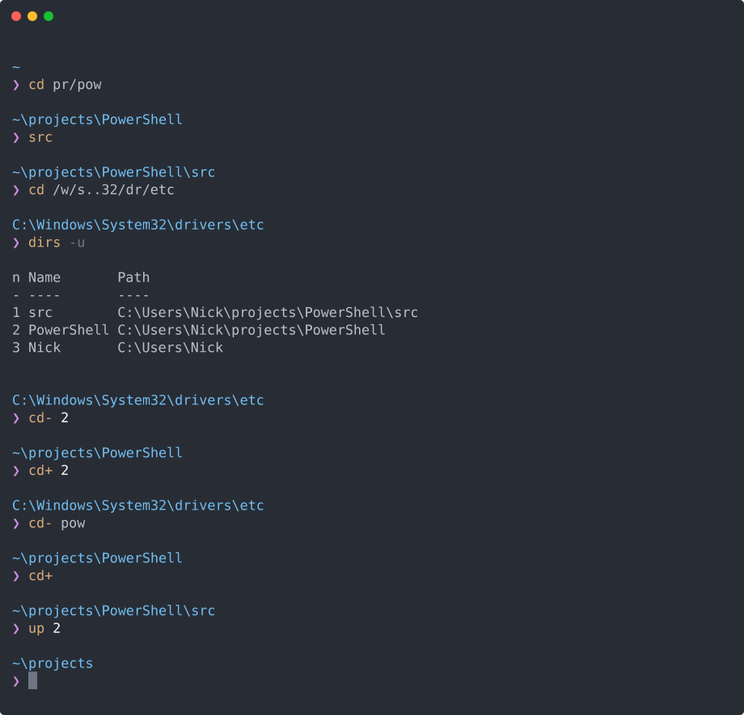

[
](https://codecov.io/gh/nickcox/cd-extras)
[
](https://www.powershellgallery.com/packages/cd-extras)



cd-extras
===========

Smarter directory navigation for PowerShell: stack-based movement, recent and frecent jumps,
abbreviated paths, multi-dot `cd`, and enhanced path completion.


## Install

From the [gallery](https://www.powershellgallery.com/packages/cd-extras/):

```powershell
Install-Module cd-extras
Import-Module cd-extras

# add to profile. e.g:

Add-Content $PROFILE `n, 'Import-Module cd-extras'
```

or get the latest from GitHub:

```powershell
git clone https://github.com/nickcox/cd-extras.git
Import-Module cd-extras/cd-extras/cd-extras.psd1 # yep, three :D
```


## Quick start

Navigate backward, forward, and upward through directory history:

```powershell
[C:/Windows/System32]> up       # or ..
[C:/Windows]> cd-               # or ~
[C:/Windows/System32]> cd+      # or ~~
[C:/Windows]> cdr               # jump to recent directory
```

Use abbreviated paths with `cd`:

```powershell
[~]> cd pr/cd
[~/projects/cd-extras]> _
```

Or skip typing `cd` altogether with `AUTO_CD`:

```powershell
[~]> projects
[~/projects]> cd-extras
[~/projects/cd-extras]> /
[C:/]> _
```


## Commands at a glance

| Command | Alias | Description |
|---|---|---|
| `Set-LocationEx` | `cd` | Change directory with cd-extras path handling |
| `Undo-Location` | `cd-`, `~` | Move backward through location history |
| `Redo-Location` | `cd+`, `~~` | Move forward through location history |
| `Step-Up` | `up`, `..` | Move to a parent directory |
| `Set-RecentLocation` | `cdr` | Jump to a recent directory |
| `Get-RecentLocation` | None | List recent directories |
| `Set-FrecentLocation` | `cdf` | Jump using frecency |
| `Get-FrecentLocation` | None | List directories by frecency |
| `Remove-RecentLocation` | None | Remove directories from recent history |
| `Add-Bookmark` | `mark` | Bookmark a directory |
| `Get-Bookmark` | None | List bookmarked directories |
| `Remove-Bookmark` | `unmark` | Remove a bookmark |
| `Get-Ancestors` | `xup` | List ancestor directories |
| `Get-Stack` | `dirs` | View undo/redo stacks |
| `Clear-Stack` | `dirsc` | Clear undo/redo stacks |
| `Get-Up` | `gup` | Get ancestor directory path |
| `Expand-Path` | `xpa` | Expand abbreviated paths |
| `Switch-LocationPart` | `cd:` | Replace part of the current path |
| `Get-CdExtrasOption` | `getocd` | View cd-extras options |
| `Set-CdExtrasOption` | `setocd` | Configure cd-extras options |


## Documentation

- **[Navigation guide](docs/navigation.md)** — backward, forward, upward movement; recent
  and frecent directories; bookmarks; completions for navigation helpers
- **[`cd` guide](docs/cd.md)** — path shortening, multi-dot `cd`, `AUTO_CD`, `CD_PATH`,
  `CDABLE_VARS`
- **[Completion guide](docs/completion.md)** — enhanced path completion, extending completion
  to other commands, colourised completions
- **[Configuration](docs/configuration.md)** — full options reference, key handlers, aliasing


## Configure

```powershell
Import-Module cd-extras

setocd AUTO_CD $false
setocd CD_PATH '~/Documents/', '~/Downloads'
setocd CDABLE_VARS
getocd AUTO_CD
```

For the full options reference, see [Configuration](docs/configuration.md).


## Upgrading from 2.x

Version 3.0 has two intentional breaking changes:

- `Step-Between` and its `cdb` alias have been removed. Use `Set-RecentLocation` or `cdr` to move
  between recently used directories.
- The `ToolTipExtraInfo` option has been replaced by `ToolTip`. The new callback receives the
  completion item and a Boolean indicating whether the results were truncated, and returns the
  complete tooltip text.

See the [changelog](https://github.com/nickcox/cd-extras/blob/master/CHANGELOG.md) for the complete
list of changes.


## Compatibility

_cd-extras_ works on Windows, macOS and Linux. It is designed for the filesystem provider
but should work with other providers too. See the [compatibility section](docs/navigation.md#compatibility)
for details on cross-platform setup and alternative providers.


## Testing

The test suite requires Pester 5.7.1. Install that version and run the suite from the repository root:

```powershell
Install-Module Pester -RequiredVersion 5.7.1 -Scope CurrentUser
./tests/test.ps1
```

To collect code coverage and write reports to a chosen directory:

```powershell
./tests/test.ps1 -Cover `
  -CoverageOutputPath ./_reports/coverage.xml `
  -TestResultOutputPath ./_reports/testresults.xml
```

Run the same static and package checks used by CI before preparing a release:

```powershell
Install-Module PSScriptAnalyzer -RequiredVersion 1.24.0 -Scope CurrentUser
Install-Module Microsoft.PowerShell.PSResourceGet -RequiredVersion 1.2.0 -Scope CurrentUser

./tests/analyse.ps1
./tests/validate-module.ps1 -ModulePath ./cd-extras/cd-extras.psd1 `
  -ApprovedExportsPath ./tests/approved-exports.psd1

$version = (Test-ModuleManifest ./cd-extras/cd-extras.psd1).Version.ToString()
$package = ./publishme.ps1 -Version $version
./tests/validate-package.ps1 -PackagePath $package -Version $version
```

## Releases

Every pushed commit produces a validated package after the analysis and test jobs pass. To publish a
release:

1. Create and push an exact version tag for the reviewed commit, such as `v3.0.0` or
   `v3.0.0-beta3`.
2. Wait for the **Run tests** workflow triggered by the tag to pass.
3. Run the **Publish to PowerShell Gallery** workflow and enter the version without the `v` prefix.

The publishing workflow downloads the package built for the tagged commit, validates it again and
publishes that exact package. A prerelease can be installed explicitly with:

```powershell
Install-Module cd-extras -AllowPrerelease
```
